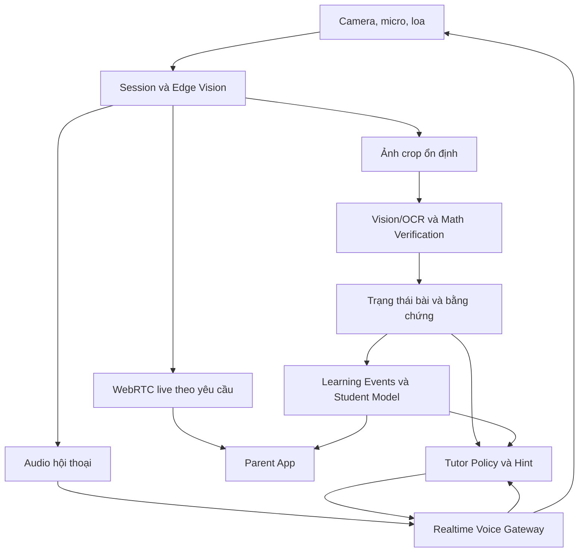

# CLAUDE_AI_Tutor.md

> Cập nhật: 03/10/2026  
> Chủ dự án: Sơn (Lê Đình Sơn)  
> Nguồn: `context.md` — Project Context: AI Study Companion *(file nguồn chưa có trong repository — xem `README.md`, mục "Tài liệu được tham chiếu nhưng chưa có")*

## 1. Mục đích tài liệu

Tài liệu này hướng dẫn Claude/Codex và đội phát triển khi phân tích, thiết kế hoặc triển khai **AI Study Companion**: một AI gia sư quan sát quá trình tự học trên giấy qua camera cố định tại bàn, hỗ trợ đúng lúc và xây dựng mô hình học tập dài hạn cho từng học sinh.

Đây hiện là **bối cảnh sản phẩm, thiết kế đề xuất và mô hình tài chính giả định**. Chưa được coi là bằng chứng rằng sản phẩm, hạ tầng, tích hợp camera, benchmark, doanh thu hoặc product-market fit đã tồn tại.

## 2. Tầm nhìn sản phẩm

Chuỗi giá trị cốt lõi:

> Quan sát quá trình học → hiểu bước giải → ghi nhận bằng chứng → hỗ trợ đúng lúc → đo tiến bộ → cá nhân hóa.

Sản phẩm phải:

- Cho học sinh tiếp tục dùng sách giáo khoa, vở và bài giáo viên giao.
- Quan sát các bước viết thực tế, không chỉ đáp án cuối.
- Ưu tiên để học sinh tự suy nghĩ và tự sửa trước khi đưa gợi ý.
- Gợi ý theo nhiều cấp độ; không mặc định đưa đáp án ngay.
- Tích lũy Student Learning Model theo concept, lỗi lặp lại, mức hỗ trợ, khả năng tự sửa, retention và hiệu quả của từng kiểu hint.
- Dùng camera như phương tiện thu nhận dữ liệu; lợi thế dài hạn phải nằm ở learner model, dữ liệu có chất lượng và trải nghiệm gia sư.

Ví dụ hành vi mong muốn: nếu học sinh viết `3(x + 2) = 15` rồi `3x + 2 = 15`, AI cần kiểm tra bước phân phối, chờ học sinh tự sửa và chỉ gợi ý kiểu: “Em thử nhân 3 với từng số trong ngoặc xem sao?”.

## 3. Trạng thái thực tế

### Đã có

- Concept và constraints chính.
- High-level design đề xuất.
- Phạm vi MVP v0.1.
- Mô hình chi phí, hòa vốn và roadmap kinh doanh giả định.

### Chưa có hoặc chưa xác nhận

- Code sản phẩm và deployment EC2.
- Camera integration hoặc hardware design hoàn chỉnh.
- Benchmark chữ viết thật và accuracy thực tế.
- Provider production hợp lệ cho trẻ em.
- Khảo sát thị trường đầy đủ, TAM/SAM/SOM hoặc willingness-to-pay đã xác nhận.
- Cohort retention, doanh thu hoặc product-market fit.

Agent không được mô tả phần “chưa có” như thành quả đã triển khai.

## 4. Phạm vi MVP v0.1

- Môn Toán lớp 6.
- Khoảng 20–30 dạng bài và taxonomy lỗi giới hạn.
- Smartphone trên giá nhìn xuống bàn hoặc laptop/USB webcam; chưa làm hardware riêng.
- Học bằng sách/vở bình thường.
- Voice hoặc app để tương tác.
- Student Model và Parent Dashboard cơ bản.
- Thử kỹ thuật nhỏ trước; sau đó pilot 20–50 học sinh và tối đa 100 hộ.

Luồng chính:

1. Phụ huynh onboarding và ghép thiết bị.
2. Cấu hình giờ được phép và vùng bàn học.
3. Bắt đầu phiên, xác nhận môn/bài.
4. Theo dõi bước viết và chất lượng ảnh.
5. OCR/vision đọc bước mới khi ảnh ổn định.
6. Kiểm chứng toán học trong domain hỗ trợ.
7. Chờ học sinh tự sửa khi hợp lý.
8. Đưa hint theo policy nếu cần.
9. Ghi learning event.
10. Tổng kết phiên và đề xuất ôn tập.

Ngoài phạm vi MVP:

- Mọi môn, mọi lớp hoặc mọi kiểu chữ viết.
- Phát hiện trạng thái tâm lý/sự tập trung qua camera.
- Lưu video mặc định.
- Hardware sản xuất hàng loạt.
- Tự huấn luyện foundation model.
- Scale ngay lên 100.000 học sinh.

## 5. Quy tắc camera và quyền riêng tư

- Camera chỉ bật khi học sinh hoặc phụ huynh bắt đầu phiên.
- Có cửa sổ giờ được phép, ví dụ 20h–24h; đây không phải thời lượng học mặc định.
- Camera cố định và hướng xuống mặt bàn, sách và vở; không chủ đích quay mặt hoặc căn phòng.
- Phải có nút dừng và đèn/trạng thái camera rõ ràng.
- Phụ huynh chỉ được xem live trong phiên được phép, theo quyền của đúng gia đình.
- Hệ thống phải thông báo khi phụ huynh mở live.
- Ngoài phiên, trạng thái phải là OFF; live view không được tự mở camera.
- Thiết bị phải tự thực thi giới hạn phiên khi mất mạng.
- Không ghi video mặc định. Ảnh tạm phải có TTL.
- Dataset đánh giá/huấn luyện cần opt-in riêng.
- API key chỉ ở server; client dùng token phiên ngắn hạn.
- Không đưa secret vào Git, tài liệu, log hoặc mã client.

## 6. Kiến trúc high level đề xuất



Các component chính:

| Component | Trách nhiệm |
|---|---|
| Camera client | Session, schedule, pairing, ROI, quality gate, audio, trạng thái và nút dừng |
| Edge Vision | Phát hiện đổi trang, thay đổi chữ, tay che, độ nét; sampling theo sự kiện |
| Parent live | WebRTC P2P, TURN fallback, xác thực theo từng phiên |
| Backend | Modular backend, family authorization, device heartbeat, session TTL |
| Vision/OCR | Adapter provider, benchmark nhiều lựa chọn, OCR chuyên dụng fallback |
| Math Verification | Rules/symbolic engine trong domain nhỏ; chấp nhận lời giải tương đương |
| Tutor Policy | Abstain, hỏi rõ, chờ tự sửa, hint nhiều cấp, hạn chế ngắt lời |
| Realtime Voice | Streaming, turn-taking, barge-in, giữ context bài đang quan sát |
| Student Model | Bằng chứng học độc lập, có hỗ trợ, tự sửa, lỗi lặp và recall |
| Dashboard/Billing | Tiến bộ, subscription, quota, support, xuất/xóa dữ liệu |
| AI Operations | Version model/prompt, evaluation, token/billing, rate limit, rollout |

Storage đề xuất gồm PostgreSQL, queue, cache và object storage có TTL. Worker perception và voice gateway phải có khả năng scale độc lập. Chưa chốt framework, ngôn ngữ hoặc cloud service.

## 7. Quy tắc perception, OCR và tutor

### Xử lý hình ảnh

- Không gửi video 25–30 FPS liên tục vào multimodal LLM.
- Edge vision phải chọn ảnh theo sự kiện và chỉ gửi crop ổn định.
- Không OCR khi tay đang che vùng cần đọc.
- Đợi tay rời, ảnh ổn định và đạt quality gate.
- Tách riêng uncertainty của ảnh, OCR và kiểm chứng toán.
- Giữ nguyên quan sát OCR cùng các ứng viên; không “sửa OCR” thành đáp án đúng dựa trên toán.
- Khi không chắc, hỏi xác nhận, yêu cầu dịch vở/chụp lại hoặc abstain.

### Tutor policy

- Không gọi học sinh làm sai nếu bằng chứng hình ảnh chưa đủ.
- Không chẩn đoán misconception từ một bước đơn lẻ.
- Chờ khoảng 20–30 giây khi hợp lý để học sinh tự sửa; đây là policy sư phạm, không phải latency hệ thống.
- Hint phải đi từ nhẹ đến cụ thể và hạn chế đưa đáp án trực tiếp.
- Không suy diễn tâm lý hoặc sự tập trung từ im lặng hay không viết.
- Mastery là ước lượng, không trình bày như điểm thi chuẩn hóa.
- Mất mạng hoặc thiếu bằng chứng phải hiển thị trạng thái gián đoạn; không bịa đánh giá.

## 8. Luồng dữ liệu và tính nhất quán

Mỗi event phải có tối thiểu:

- `session_id`
- `sequence`
- `timestamp`
- `page_version` hoặc `problem_version`

Mục đích là chống lặp, sai thứ tự và phát hint cho trạng thái cũ. Queue phải ưu tiên trạng thái mới và loại snapshot đã bị thay thế.

Entities tối thiểu:

- Family/Consent
- Student
- Device
- StudySession
- ProblemAttempt
- ObservedStep
- TutorIntervention
- LearningEvent
- ConceptMastery
- Subscription

Learning event minh họa:

```json
{
  "student_id": "demo_student",
  "session_id": "demo_session",
  "problem_id": "demo_problem",
  "concept": "distributive_property",
  "observed_step": "3x + 2 = 15",
  "error_type": "partial_distribution",
  "hint_level": 1,
  "self_corrected": false,
  "resolved": true,
  "time_to_resolve_seconds": 47,
  "evidence_quality": "confirmed"
}
```

Đây chỉ là ví dụ, chưa phải schema/API đã chốt.

## 9. Chỉ tiêu pilot cần đo

- Voice p95 từ cuối câu người dùng đến bắt đầu trả lời: `< 2 giây`.
- Xử lý một bước hoàn chỉnh: `< 5 giây`.
- Parent live trên mạng thử nghiệm: `< 1,5 giây`.
- Can thiệp sửa sai nhầm: `< 2%` trong các can thiệp đã phát ra.
- Báo cáo riêng coverage, abstention và false intervention.
- Xử lý được ít nhất 90% bước rõ trong domain hỗ trợ.
- Theo dõi chi phí trung bình và P90 trên mỗi học sinh, token, retry, turn count và history rebilling.
- Đo learning outcome bằng bài tương đương độc lập, không chỉ dashboard mastery.

Các chỉ tiêu trên là **mục tiêu pilot**, không phải kết quả đã đạt.

## 10. Ràng buộc nhà cung cấp

- Chưa có provider production được chọn.
- Theo context cập nhật ngày 03/10/2026, Gemini Developer API có hạn chế với API client hướng tới hoặc có khả năng được người dưới 18 tuổi truy cập.
- Không tự suy luận rằng parental consent hoặc chuyển sang một dịch vụ khác tự động giải quyết điều khoản.
- Trước pilot trẻ thật phải xác minh: độ tuổi, retention, data training, quyền dữ liệu, vị trí xử lý, quota, hợp đồng và cơ chế xóa dữ liệu.
- Nếu dùng model self-host, phải xác minh license và năng lực vận hành.
- Giá và điều khoản phải được kiểm tra lại tại thời điểm ra quyết định.

## 11. Nguyên tắc làm việc cho coding agent

Trước khi thay đổi code:

1. Đọc tài liệu này, `README`, `AGENTS.md`/`CLAUDE.md` và cấu trúc repository hiện có.
2. Kiểm kê trạng thái thực tế: code, branch, dependency, test, infrastructure và biến môi trường.
3. Phân biệt rõ:
   - yêu cầu đã được người dùng phê duyệt;
   - đề xuất thiết kế;
   - giả định tài chính/kỹ thuật;
   - dữ liệu hoặc kết quả đã đo.
4. Không tự nhận có EC2, domain, credential, camera integration hoặc provider nếu chưa kiểm chứng.

Khi triển khai:

- Ưu tiên vertical slice nhỏ chạy end-to-end.
- Giữ adapter để có thể thay provider.
- Phân biệt mock với integration thật trong code, log và tài liệu.
- Không dùng mock OCR/hint để tuyên bố đã giải quyết khả năng nhìn bài thực tế.
- Đo token, latency, retry và chi phí ngay từ đầu.
- Thiết kế idempotency, timeout, retry có giới hạn và xử lý event lỗi thứ tự.
- Không triển khai provider cho trẻ em khi điều khoản chưa được xác nhận.
- Không mở rộng ngoài phạm vi được giao nếu cần thêm quyền hoặc tạo chi phí đáng kể.

Sau khi thay đổi:

1. Chạy test phù hợp với mức rủi ro.
2. Ghi cách chạy, kết quả test và phần chưa kiểm chứng.
3. Cập nhật tài liệu/changelog ngắn.
4. Thay giả định bằng actual khi có bằng chứng; không xóa lịch sử quyết định quan trọng.

## 12. Vertical slice ưu tiên

Triển khai theo chuỗi nhỏ nhất sau:

```text
Start session
→ Camera capture
→ Detect image change/quality
→ OCR observed step
→ Verify step
→ Tutor policy/hint
→ Voice output
→ Learning event
→ Parent/student dashboard
```

Mỗi bước phải có mock adapter để test độc lập, sau đó thay dần bằng integration hợp lệ. Definition of done cho vertical slice phải gồm:

- Một luồng end-to-end có thể chạy lại.
- Input/output được lưu vết có kiểm soát.
- Uncertainty và abstention hiển thị rõ.
- Test cho happy path, ảnh không rõ, tay che, event trùng/sai thứ tự và provider timeout.
- Có số đo latency, token/call và chi phí ước tính từ dữ liệu chạy thật.

## 13. Gate trước khi mở rộng

Không tăng quy mô chỉ dựa trên demo. Cần qua các gate:

- Phụ huynh thực sự trả tiền hoặc có bằng chứng willingness-to-pay đáng tin cậy.
- Provider đủ điều kiện phục vụ trẻ em.
- Benchmark OCR/step verification trên dữ liệu được phép sử dụng.
- False intervention, coverage và abstention đạt ngưỡng pilot.
- AI cost trung bình và P90 nằm trong unit economics cho phép.
- Retention trả phí 30/90 ngày đủ để kiểm chứng giả định churn.
- Learning outcome được đo độc lập.

Các con số kinh doanh trong context là mô hình giả định và không được dùng như dữ liệu doanh thu thực tế.

## 14. Prompt khởi động đề xuất

> Đọc `CLAUDE_AI_Tutor.md` cùng tài liệu repository. Tóm tắt trạng thái thực tế và kiểm kê môi trường hiện có trước khi thay đổi. Sau đó đề xuất hoặc triển khai vertical slice MVP nhỏ nhất trong phạm vi được giao. Phân biệt rõ mock với integration thật, ghi cách chạy và kết quả kiểm thử. Không dùng nhà cung cấp cho trẻ em khi điều khoản chưa được xác nhận và không ghi secret vào code hoặc tài liệu.

## 15. Nguồn cần kiểm tra lại

- Gemini API Terms: https://ai.google.dev/gemini-api/terms
- Gemini API Pricing: https://ai.google.dev/gemini-api/docs/pricing
- Gemini Live API: https://ai.google.dev/gemini-api/docs/live-api
- Gemini Live API best practices: https://ai.google.dev/gemini-api/docs/live-api/best-practices
- Mathpix API pricing: https://mathpix.com/pricing/api
- Cloudflare Realtime pricing: https://developers.cloudflare.com/realtime/sfu/platform/pricing/

Không coi nội dung giá hoặc điều khoản đã đọc trước đây là hiện hành nếu chưa kiểm tra lại tại thời điểm triển khai.
