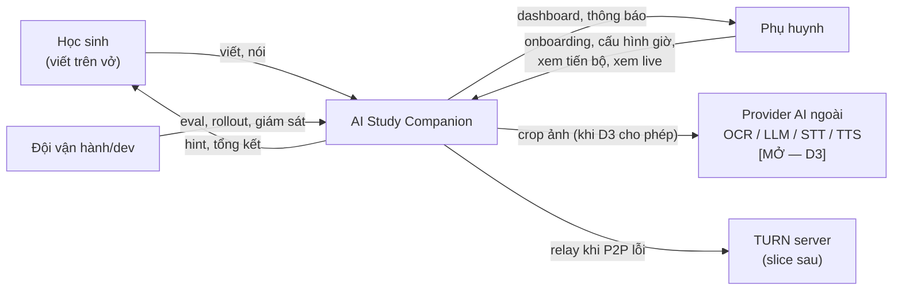
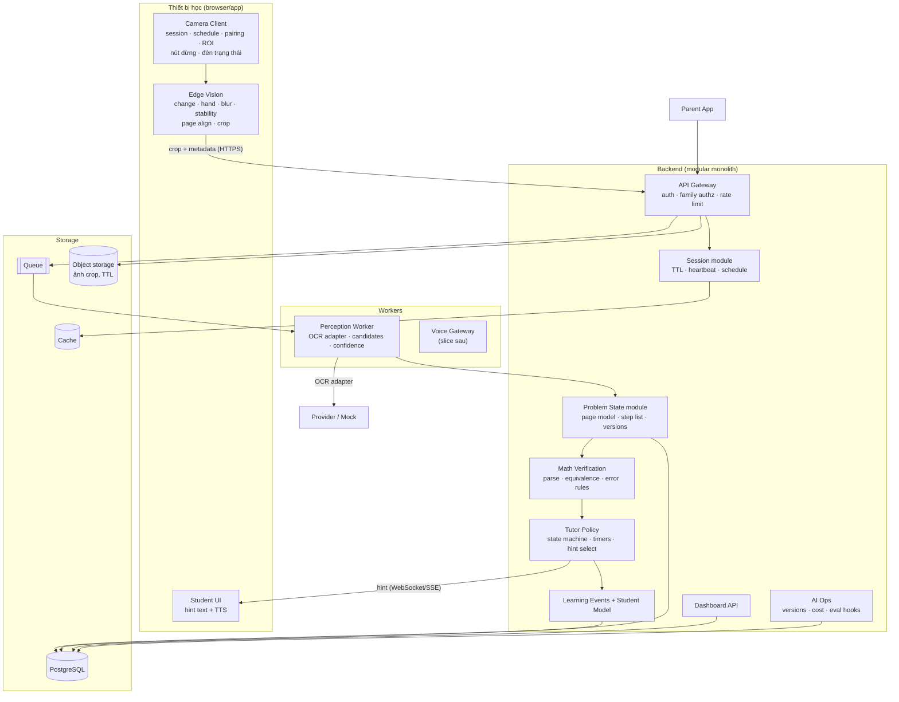
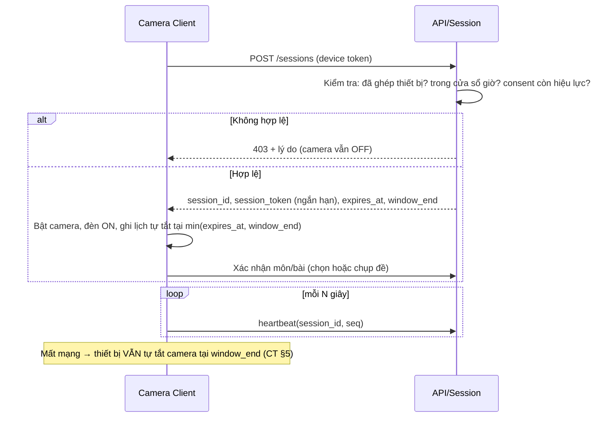
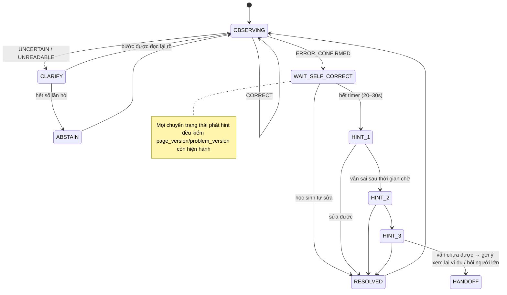

# HLD-AITUTOR — High Level Design

> **Trạng thái:** `DRAFT — AI soạn, CHƯA duyệt`. Không phải kiến trúc đã chốt.
> **Ngày:** 2026-10-03 · **Soạn bởi:** Claude Code (Opus 5.5) · **Người duyệt:** Lê Đình Sơn (chưa duyệt)
> **Input:** `CLAUDE_AI_Tutor.md` (**CT**) · `docs/capstone/SCOPE-AITUTOR.md` (**SCOPE**, DRAFT).
> **Thứ tự:** chủ dự án yêu cầu làm HLD **trước** SPEC (Playbook để Architecture ở bước [3]). Khi SPEC xong, phải đối chiếu lại HLD ↔ SPEC; mục nào lệch thì sửa và ghi lại.

**Mục tiêu của tài liệu:** làm rõ **mọi vấn đề kỹ thuật** trước khi viết code: thành phần, luồng dữ liệu, thuật toán cốt lõi, ranh giới tin cậy, ngân sách latency, rủi ro kỹ thuật và **spike** để gỡ từng rủi ro.

Quy ước nhãn: `[CT]` = đã có trong luật dự án · `[ĐỀ XUẤT]` = AI đề xuất, chờ duyệt · `[MỞ]` = chưa quyết, không để AI đoán · `[GIẢ ĐỊNH]` = chưa đo.

**Không có con số nào trong tài liệu này là kết quả đo.** Mọi chỉ tiêu là mục tiêu `[CT §9]` hoặc ngân sách thiết kế `[ĐỀ XUẤT]`.

---

## 1. Nguyên tắc kiến trúc

| # | Nguyên tắc | Nguồn |
|---|---|---|
| P1 | **Bằng chứng trước, can thiệp sau.** Không kết luận "sai" khi uncertainty của ảnh, OCR hoặc toán chưa đủ thấp. Abstain là kết quả hợp lệ. | CT §7 |
| P2 | **Không gửi video liên tục.** Edge chọn ảnh theo sự kiện; server chỉ nhận crop ổn định. | CT §7 |
| P3 | **Adapter cho mọi phụ thuộc AI bên ngoài** (OCR, LLM, STT, TTS). Mỗi adapter có bản **mock gắn nhãn** để chạy được khi chưa có provider. | CT §11–12 |
| P4 | **Privacy là thiết kế, không phải cấu hình sau.** Camera OFF ngoài phiên, ảnh có TTL, không lưu video, secret chỉ ở server. | CT §5 |
| P5 | **Deterministic ở lõi, AI ở rìa.** Kiểm chứng toán và policy dùng rules/symbolic, kiểm thử được. AI dùng cho nhận dạng (OCR) và (sau này) diễn đạt hint, luôn qua gate. | CT §6–7 · ĐỀ XUẤT |
| P6 | **Mọi event có thứ tự và phiên bản.** Tránh xử lý trùng, xử lý sai thứ tự, hoặc hint cho trạng thái cũ. | CT §8 |
| P7 | **Đo từ ngày đầu.** Latency, token/call, retry, chi phí mỗi bước được ghi cùng lúc với chức năng. | CT §11 |
| P8 | **Modular monolith + worker tách rời.** Một backend chia module; perception và voice là worker scale độc lập. | CT §6 · ĐỀ XUẤT |

---

## 2. Context (C4 mức 1)



Ranh giới tin cậy:
- **Thiết bị học sinh** không được tin: chỉ giữ token phiên ngắn hạn, không giữ API key.
- **Provider AI ngoài** là vùng dữ liệu rời khỏi hệ thống. Chỉ được dùng khi D3 và các gate ở CT §10 đã qua. Chỉ gửi crop tối thiểu, không gửi định danh học sinh.

---

## 3. Container (C4 mức 2)



| Container | Trách nhiệm | Slice đầu? |
|---|---|---|
| Camera Client | Bắt đầu/dừng phiên, kiểm tra cửa sổ giờ (cả khi offline), ROI, đèn trạng thái, nút dừng | Có (browser, D1) |
| Edge Vision | Chọn khung ảnh: phát hiện thay đổi, tay che, độ nét, ổn định; căn trang; cắt vùng mới | Có |
| API Gateway | Xác thực, phân quyền theo gia đình, rate limit, cấp token phiên | Có (bản tối thiểu) |
| Session | Vòng đời phiên, TTL, heartbeat, thực thi lịch | Có |
| Problem State | Mô hình trang: các dòng, bước, `page_version`, `problem_version` | Có |
| Perception Worker | Gọi OCR adapter, chuẩn hoá output, tách uncertainty | Có (mock OCR nếu D3 chưa chốt) |
| Math Verification | Parse → AST, kiểm tương đương bước, phân loại lỗi | Có |
| Tutor Policy | State machine can thiệp, timer chờ tự sửa, chọn hint | Có |
| Learning Events / Student Model | Ghi event; tổng hợp mastery (ước lượng) | Event: có · Model: tối thiểu |
| Dashboard API | Tổng kết phiên | Có (bản nội bộ, Q9) |
| Voice Gateway | Realtime voice | Không (D2) |
| Parent live (WebRTC/TURN) | Xem live trong phiên | Không (SCOPE 2.4) |
| AI Ops | Version model/prompt, cost, eval | Có (log + bảng cost) |

---

## 4. Luồng chính

### 4.1 Bắt đầu phiên



`[ĐỀ XUẤT]` Session token sống ngắn, gia hạn bằng heartbeat. Mất heartbeat quá ngưỡng → server đóng phiên. Thiết bị tự thực thi `window_end` theo giờ cục bộ đã được đồng bộ lúc bắt đầu phiên.

### 4.2 Quan sát một bước

```mermaid
sequenceDiagram
    participant E as Edge Vision
    participant A as API
    participant W as Perception Worker
    participant S as Problem State
    participant M as Math Verify
    participant T as Tutor Policy
    participant U as Student UI
    E->>E: Khung hình → căn trang → diff với ảnh ổn định trước
    E->>E: Có thay đổi? tay rời? đủ nét? ổn định ≥ X ms?
    E->>A: crop vùng thay đổi + {session_id, seq, page_version, bbox, quality}
    A->>A: Idempotency theo (session_id, seq); bỏ nếu page_version cũ
    A->>W: job (crop_ref)
    W->>W: OCR adapter → candidates[{latex, conf}], image_quality
    W->>S: ObservedStep(candidates, uncertainties)
    S->>M: verify(step_k-1, candidates)
    M-->>S: verdict per candidate: equivalent / not_equivalent / unparseable
    S->>T: StepEvidence(verdicts, uncertainties, problem_version)
    T->>T: Cập nhật state machine (mục 7)
    T-->>U: (nếu cần) hỏi lại / hint L1..L3
    T->>A: LearningEvent
```

### 4.3 Học sinh tự sửa và trạng thái cũ

- Khi nghi lỗi **có bằng chứng xác nhận** → vào `WAITING_SELF_CORRECT` với timer `[CT]` 20–30 giây.
- Trong lúc chờ, có bước mới hoặc dòng bị gạch/sửa:
  - Bước mới tương đương bước đúng → `self_corrected = true`, huỷ hint.
  - Ngược lại → tiếp tục chờ tới hết timer.
- Hint chỉ được phát nếu `problem_version` và `page_version` của bằng chứng **vẫn là phiên bản hiện hành**. Nếu đã đổi → huỷ hint (chống hint cho trạng thái cũ, CT §8).

### 4.4 Kết thúc phiên
Bấm dừng, hết giờ, hoặc mất heartbeat → camera OFF → server đóng phiên → sinh tổng kết (bài đã làm, lỗi, hint, tự sửa, phần abstain) → hẹn job xoá ảnh theo TTL.

---

## 5. Edge Vision — thiết kế chi tiết

**Đầu vào:** luồng camera ở FPS thấp cho phân tích `[ĐỀ XUẤT: 2–5 FPS]` — không cần 25–30 FPS.

| Khâu | Kỹ thuật ứng viên | Output |
|---|---|---|
| Căn trang | Phát hiện mép trang/vở + homography về toạ độ trang chuẩn; fallback: ROI cố định do người dùng vẽ | Ảnh trang đã căn |
| Phát hiện đổi trang | So khác biệt toàn cục với trang trước vượt ngưỡng lớn → `page_version + 1` | Event `PAGE_CHANGED` |
| Phát hiện chữ mới | Diff ảnh nhị phân (sau threshold) giữa ảnh ổn định trước và hiện tại → các vùng thay đổi → gom theo dòng | bbox vùng mới |
| Tay/bút che | Mô hình phát hiện bàn tay chạy trên thiết bị (ứng viên: MediaPipe Hand Landmarker) hoặc heuristic màu da + chuyển động | `occluded: bool` + vùng |
| Độ nét | Variance của Laplacian trên vùng crop | `sharpness` |
| Ổn định | Không có chuyển động đáng kể trong cửa sổ `[ĐỀ XUẤT: 1–1.5 s]` | `stable: bool` |
| Gửi | Chỉ gửi khi: có vùng mới ∧ không bị che ∧ đủ nét ∧ ổn định. Crop = dòng mới + ngữ cảnh (dòng trước) | crop JPEG + metadata |

**Rủi ro:** căn trang khi vở bị xê dịch hoặc cong gáy; nét bút chì mờ; bóng tay; ánh sáng đèn bàn. → Spike **S2** và **S3**.

**Không làm ở edge:** OCR, đánh giá đúng/sai, suy đoán sự tập trung (CT §4 ngoài phạm vi).

---

## 6. Perception & Math Verification

### 6.1 OCR adapter — hợp đồng

```text
recognize(crop, context) -> {
  candidates: [{ latex: str, plain: str, confidence: float }],   # top-k, không sửa theo toán
  image_quality: { sharpness, occlusion, coverage },
  provider: str, model_version: str,
  latency_ms, tokens_in, tokens_out, cost_estimate, retries
}
```

- **Giữ nguyên các ứng viên** OCR trả về. Cấm chọn ứng viên "đúng toán" để che lỗi OCR (CT §7).
- Uncertainty tách làm 3 loại: `image_uncertainty` (edge + quality) · `ocr_uncertainty` (độ phân tán giữa các candidate, confidence) · `math_uncertainty` (parse được không, verdict có nhất quán giữa các candidate không).
- Ứng viên provider: OCR toán chuyên dụng (vd. Mathpix) · LLM đa phương thức · OCR self-host. **Chưa chọn**: phụ thuộc D3, benchmark S1 và kiểm tra điều khoản cho trẻ em (CT §10). Giá và điều khoản phải kiểm tra lại tại thời điểm quyết định.
- **Mock OCR:** đọc nhãn ground-truth đi kèm ảnh test và có thể **cố tình gây nhiễu** (thay ký tự dễ nhầm như `1/7`, `x/×`, `-/=`) để test đường abstain. Mọi output mock gắn `provider="MOCK"`.

### 6.2 Kiểm chứng toán

Domain slice đầu `[ĐỀ XUẤT, chờ Q1]`: một dạng bài, phương trình bậc nhất một ẩn có ngoặc.

1. **Parse:** `latex/plain → AST` (ứng viên: SymPy parser với grammar giới hạn). Không parse được → `unparseable`.
2. **Bước hợp lệ:** bước `k` được coi là đúng nếu **tập nghiệm** của nó bằng tập nghiệm của bước `k-1` (với phương trình), hoặc bằng nhau về ký hiệu (với biểu thức). Cách này chấp nhận được lời giải tương đương viết theo cách khác.
3. **Phân loại lỗi:** áp các "mutation rule" lên bước `k-1` (phân phối thiếu, sai dấu khi chuyển vế, cộng nhầm hệ số…). Nếu bước `k` khớp đúng một mutation → `error_type`. Không khớp → `unknown_error`.
4. **Quy tắc nhiều ứng viên** (cốt lõi chống false intervention):

| Verdict của các candidate | Kết luận |
|---|---|
| Mọi candidate tin cậy đều `equivalent` | `CORRECT` |
| Mọi candidate tin cậy đều `not_equivalent` + ảnh tốt | `ERROR_CONFIRMED` |
| Candidate lẫn lộn đúng/sai | `UNCERTAIN` → hỏi lại/abstain, **không** chọn candidate đúng |
| `unparseable` / ảnh kém | `UNREADABLE` → yêu cầu dịch vở/viết rõ hoặc abstain |

5. **Không chẩn đoán misconception từ một bước** (CT §7). `error_type` chỉ là bằng chứng cấp bước; misconception cần ≥N lần lặp `[ĐỀ XUẤT: N do Student Model quyết định]`.

---

## 7. Tutor Policy — state machine



- **Hint `[ĐỀ XUẤT]`:** slice đầu dùng **template theo `error_type` × level**, viết sẵn và được người duyệt nội dung sư phạm. Lý do: deterministic, không bịa, kiểm thử được, chi phí 0. Diễn đạt hint bằng LLM chỉ xem xét ở slice sau, qua gate (không lộ đáp án, đúng error_type).
  - L1: hướng sự chú ý ("Em xem lại bước phân phối nhé").
  - L2: gợi câu hỏi ("Em thử nhân 3 với từng số trong ngoặc xem sao?").
  - L3: ví dụ tương tự (không phải đáp án bài đang làm).
- **Hạn chế ngắt lời:** tối đa 1 can thiệp đang hoạt động; không hint khi học sinh đang viết (edge báo `occluded`/đang chuyển động).
- **Không suy diễn từ im lặng** (CT §7): im lặng/không viết không kích hoạt hint, chỉ ghi `idle` trong event.
- Mất mạng hoặc thiếu bằng chứng → UI hiện "gián đoạn", không đánh giá.

---

## 8. Dữ liệu

### 8.1 Event envelope `[CT §8 + ĐỀ XUẤT]`

```json
{
  "event_id": "uuid",
  "session_id": "…", "sequence": 42, "timestamp": "ISO-8601 (server)",
  "client_timestamp": "ISO-8601", "page_version": 3, "problem_version": 1,
  "type": "STEP_OBSERVED | VERDICT | INTERVENTION | PAGE_CHANGED | …",
  "payload": { }
}
```

Quy tắc:
- Khoá idempotency là `(session_id, sequence)`. Trùng → bỏ.
- Event mang `page_version` nhỏ hơn bản hiện hành → chỉ lưu log, không kích hoạt policy.
- Queue giao "ít nhất một lần"; consumer phải idempotent; "bản mới nhất thắng" theo từng phiên.

### 8.2 Entity và độ nhạy

| Entity | Trường chính | Độ nhạy | Lưu bao lâu `[MỞ — Q6]` |
|---|---|---|---|
| Family / Consent | phụ huynh, consent scope, opt-in dataset | **Cao** (PII người lớn) | Theo hợp đồng |
| Student | tên hiển thị, lớp, family_id | **Rất cao** (trẻ em) | Tới khi xoá tài khoản |
| Device | pairing, trạng thái, last_heartbeat | Trung bình | — |
| StudySession | thời gian, trạng thái, lý do kết thúc | Cao | — |
| ProblemAttempt | đề bài, kết quả | Cao | — |
| ObservedStep | candidates, uncertainties, crop_ref | **Rất cao** (chữ viết trẻ em) | Text: theo chính sách · **ảnh: TTL ngắn** |
| TutorIntervention | level, error_type, outcome | Cao | — |
| LearningEvent | xem CT §8 | Cao | — |
| ConceptMastery | ước lượng theo concept | Cao | — |
| Subscription | gói, quota | Trung bình | — |
| AuditLog | ai xem live/xuất/xoá | Cao | Dài hơn dữ liệu chính |
| AICallLog | provider, model_version, latency, tokens, cost | Thấp (không chứa ảnh/PII) | — |

**Ảnh crop:** object storage có lifecycle xoá theo TTL `[MỞ: giá trị TTL]`. Chỉ giữ lâu hơn TTL khi có opt-in dataset riêng (CT §5).

---

## 9. Bảo mật & privacy

| Mối đe doạ (STRIDE) | Ví dụ | Biện pháp |
|---|---|---|
| Spoofing | Thiết bị giả mạo mở phiên | Pairing có xác nhận của phụ huynh; device token thu hồi được; session token ngắn hạn |
| Tampering | Client sửa `sequence`/`page_version` để chèn bước | Server gán timestamp; sequence tăng đơn điệu; bỏ event bất thường |
| Repudiation | Phụ huynh xem live mà không ai biết | AuditLog + thông báo trên thiết bị học (CT §5) |
| Info disclosure | Lộ ảnh vở, API key | Key chỉ ở server; ảnh TTL; mã hoá khi truyền và khi lưu; phân quyền theo family ở tầng dữ liệu; không gửi PII cho provider |
| DoS / chi phí | Client gửi ảnh liên tục làm cháy quota AI | Rate limit theo phiên; dedupe crop; quota mỗi học sinh; circuit breaker theo provider |
| Elevation | Phụ huynh A xem dữ liệu con nhà B | Mọi truy vấn có điều kiện `family_id`; test âm tính bắt buộc |
| Camera ngoài phiên | Live view tự bật camera | Live view **không** có quyền bật camera; chỉ gắn vào phiên đang chạy (CT §5) |

---

## 10. Ngân sách latency `[ĐỀ XUẤT — chưa đo]`

**Định nghĩa đề xuất** cho "xử lý một bước < 5 s" (CT §9): tính **từ lúc edge chốt crop ổn định tới lúc verdict/hint sẵn sàng hiển thị**. Không tính thời gian chờ tay rời và không tính timer chờ tự sửa (đó là policy sư phạm). `[MỞ — cần chủ dự án xác nhận định nghĩa]`

| Khâu | Ngân sách |
|---|---|
| Upload crop | ≤ 0.5 s |
| Hàng đợi + điều phối | ≤ 0.3 s |
| OCR | ≤ 3.0 s |
| Parse + verify | ≤ 0.3 s |
| Policy + đẩy xuống UI | ≤ 0.4 s |
| **Dự phòng** | 0.5 s |
| **Tổng** | **≤ 5.0 s** (p95, mục tiêu) |

OCR là khâu rủi ro nhất → Spike **S1** đo p50/p95 thật cho từng ứng viên.

---

## 11. Mô hình chi phí (công thức, chưa có số)

```text
cost_per_session = Σ_steps (ocr_calls × giá_ocr + retries × giá_ocr)
                 + hint_llm_calls × giá_llm      # = 0 với template
                 + tts_chars × giá_tts
                 + storage(ảnh × TTL) + băng thông
cost_per_student_month = avg(cost_per_session) × sessions/tháng   # theo dõi cả P90
```

Giá provider **không ghi ở đây**: phải lấy giá hiện hành tại thời điểm quyết định (CT §10, §15). Số bước mỗi phiên, số phiên mỗi tháng và tỉ lệ retry đều `[GIẢ ĐỊNH]` cho tới khi có dữ liệu chạy thật.

---

## 12. Quan sát hệ thống & AI Ops

- **Metric:** latency từng khâu (p50/p95), calls/tokens/cost theo provider, retry, timeout, tỉ lệ `CORRECT/ERROR_CONFIRMED/UNCERTAIN/UNREADABLE`, tỉ lệ abstain, coverage, false intervention (cần ground truth).
- **Version:** mỗi event verdict ghi `ocr_provider`, `model_version`, `rules_version`, `hint_template_version`.
- **Eval harness:** bộ ảnh có nhãn (Q7) chạy lại toàn bộ pipeline perception → verify → policy. So sánh các provider và các phiên bản rules. Đây là cổng trước khi đổi provider/rules.
- **Log:** không ghi ảnh, không ghi PII. Ghi `crop_ref` (hết hạn theo TTL).

---

## 13. Triển khai

- **Dev/slice đầu:** chạy local bằng 1 lệnh (container compose), dùng mock adapter mặc định. Biến môi trường chọn adapter; thiếu key → không được tự rơi về provider thật.
- **Cloud:** `[MỞ — Q5]`. CT nhắc EC2 nhưng ghi "chưa có". Không deploy trước khi chốt vùng dữ liệu.

---

## 14. Lựa chọn công nghệ (chưa chốt — CT §6)

| Hạng mục | Ứng viên | Đề xuất | Trạng thái |
|---|---|---|---|
| Edge vision | Browser: OpenCV.js + MediaPipe (JS/WASM) · Native mobile | Browser (theo D1) | `[ĐỀ XUẤT]` |
| Backend | Python (FastAPI) · Node (NestJS) | **Python**: SymPy cho verify, hệ sinh thái CV/ML và eval cùng ngôn ngữ | `[ĐỀ XUẤT]` |
| Math engine | SymPy · rules tự viết | SymPy + grammar giới hạn | `[ĐỀ XUẤT]` |
| DB | PostgreSQL | PostgreSQL | `[CT]` |
| Queue | Redis Streams · RabbitMQ · cloud queue | Redis (gộp luôn vai trò cache cho slice đầu) | `[ĐỀ XUẤT]` |
| Object storage | S3-compatible (MinIO ở local) | S3-compatible có lifecycle TTL | `[ĐỀ XUẤT]` |
| Realtime xuống UI | WebSocket · SSE | WebSocket | `[ĐỀ XUẤT]` |
| OCR / LLM / STT / TTS | Xem 6.1 | — | `[MỞ — D3, S1]` |

---

## 15. Rủi ro kỹ thuật & spike

Mỗi spike là một thí nghiệm nhỏ, có tiêu chí thoát. **Spike chưa xong thì phần phụ thuộc chưa được coi là khả thi.**

| ID | Câu hỏi kỹ thuật | Cách làm | Tiêu chí thoát `[ĐỀ XUẤT]` | Bị chặn bởi |
|---|---|---|---|---|
| **S1** | OCR chữ viết tay toán có đạt yêu cầu không? Latency và chi phí ra sao? | Bộ ~100–200 dòng viết tay **người lớn tự tạo** (Q7); chạy mock → các ứng viên; đo accuracy theo dòng, p50/p95, cost/call | Có ≥1 ứng viên cho thấy hướng tiệm cận mục tiêu ≥90% bước rõ; có số p95 thật | **D3** (với provider ngoài) |
| **S2** | Phát hiện dòng mới bằng diff có ổn khi vở xê dịch, ánh sáng thay đổi? | Quay ~10 phiên mẫu người lớn; chạy pipeline edge offline; đếm số lần bỏ sót và báo nhầm dòng mới | Bỏ sót và báo nhầm dưới ngưỡng do chủ dự án đặt | — |
| **S3** | Phát hiện tay/bút che chạy được realtime trên laptop phổ thông? | Đo FPS và CPU của hand detector trong browser | Chạy ≥ FPS phân tích đề xuất, không làm treo UI | — |
| **S4** | Parse + kiểm tương đương xử lý được output OCR thực tế (ký hiệu lạ, thiếu ngoặc)? | Đưa output S1 qua verify; đếm `unparseable` và verdict sai | Tỉ lệ `unparseable` và verdict sai đủ thấp để đường abstain gánh được | S1 |
| **S5** | Quy tắc nhiều candidate có giữ false intervention < 2%? | Mô phỏng trên dataset S1 có ground truth + nhiễu mock | False intervention < 2% trên tập thử, kèm coverage và abstention báo riêng | S1, S4 |
| **S6** | Thực thi giờ phiên khi offline có tin cậy? (đổi giờ hệ thống, tab ẩn, sleep) | Thử các kịch bản trên browser | Camera luôn OFF đúng hạn trong mọi kịch bản thử | D1 |
| **S7** | Chất lượng TTS tiếng Việt cho hint có chấp nhận được? | Nghe thử 20 hint mẫu | Chủ dự án/giáo viên chấp nhận | D3 |
| **S8** | Provider nào đủ điều kiện phục vụ trẻ em? | Rà điều khoản hiện hành: độ tuổi, retention, training, vùng xử lý, xoá dữ liệu (CT §10) | Có văn bản xác nhận; nếu không có → self-host hoặc dừng pilot | Q6, chuyên gia pháp lý |

Thứ tự gợi ý: **S2, S3, S6** (không cần provider) → **S1** (khi D3 được chốt) → **S4 → S5** → S7, S8 song song.

---

## 16. Quyết định còn mở

| ID | Quyết định | Chặn |
|---|---|---|
| D3 | Có được dùng provider ngoài với dữ liệu người lớn/tổng hợp ở giai đoạn thử kỹ thuật? | S1, S4, S5, S7 |
| D6 | Tier 1 / Tier 2 | Bước [8] |
| Q1 | Bộ sách, danh sách dạng bài, taxonomy lỗi | Grammar parser, mutation rules |
| Q4 | Team / thời gian / ngân sách | Estimation |
| Q5 | Vùng lưu dữ liệu / cloud | Deploy |
| Q6 | Pháp lý dữ liệu trẻ em; TTL ảnh và text | Pilot; giá trị TTL ở 8.2 |
| L1 | Định nghĩa đo "< 5 s / bước" (mục 10) | Spike S1 tiêu chí latency |
| L2 | Ngưỡng thoát cho S2 (bỏ sót/báo nhầm) | S2 |
| L3 | Ai duyệt nội dung sư phạm của hint template | Hint template |

---

## 17. Telemetry

| Trường | Giá trị |
|---|---|
| Tool | Claude Code · Opus 5.5 |
| Token (est) | ~25k output (ước tính thô, chưa reconcile) |
| Thời gian (giờ người thật) | N/A — chủ dự án điền thời gian review |
| Số vòng lặp | 1 |
| Rework | Chưa |
| PM-edit | Chưa có — chủ dự án ghi khi duyệt |
